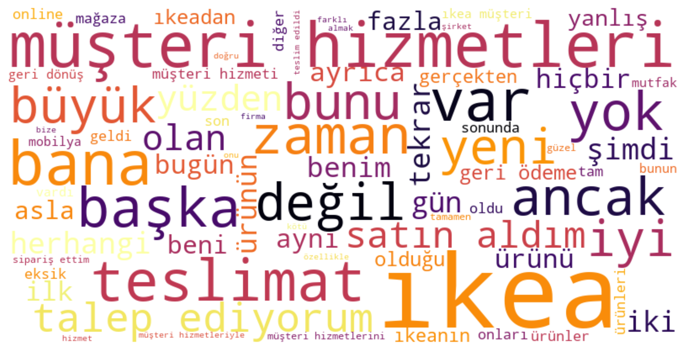
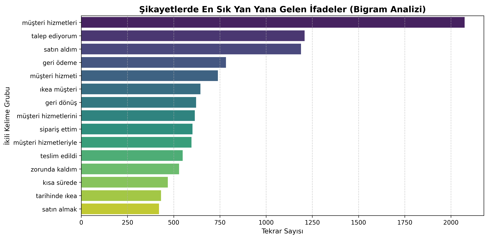
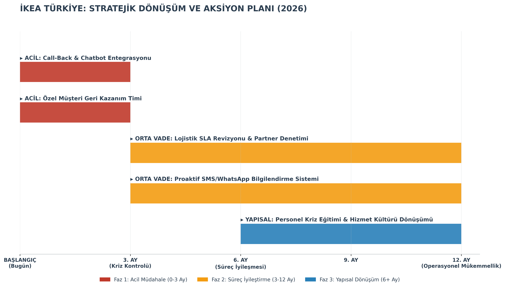

# 📢 [PROJE RAPORUNU GÖRÜNTÜLEMEK İÇİN TIKLA](ikea%20analiz%20raporu.pdf)

###

  
  <h1>IKEA TÜRKİYE MÜŞTERİ ŞİKAYETLERİ ANALİZİ</h1>
  
<strong>14.000+ Müşteri Geri Bildirimi Üzerine Veri Madenciliği ve Kök Neden Analizi</strong>

---

### 📋 PROJE HAKKINDA

Bu proje, IKEA Türkiye operasyonlarına yönelik internet üzerinde yer alan 14.265 adet müşteri şikayetini analiz etmeyi amaçlamaktadır. Temel hedef, büyük veri yığınları içerisindeki gizli örüntüleri ortaya çıkararak, müşteri memnuniyetsizliğinin kök nedenlerini tespit etmek ve veriye dayalı stratejik çözüm önerileri geliştirmektir.

Proje, sadece mevcut durumu raporlamakla kalmayıp, "Müşteriler neden şikayet ediyor?" ve "Markayı neden terk ediyorlar?" sorularına somut verilerle cevap vermektedir.

---

### ⚙️ METODOLOJİ VE ANALİZ SÜRECİ

Proje, veri toplama aşamasından strateji geliştirmeye kadar uçtan uca bir veri bilimi yaşam döngüsünü takip etmiştir.

#### 1. Veri Toplama ve Ön İşleme
* **Veri Kaynağı:** Halka açık şikayet platformlarından Web Scraping yöntemi ile veri çekilmiştir.
* **Veri Seti:** Toplam 14.265 adet yapılandırılmamış metin verisi.
* **Doğal Dil İşleme (NLP):** Ham metin verileri temizlenmiş, etkisiz kelimeler (stopwords) çıkarılmış ve analize uygun hale getirilmiştir.

#### 2. Sınıflandırma Yöntemi

Projeda, veri setini kategorilere ayırmak için **Kural Tabanlı Sınıflandırma (Rule-Based Classification)** yöntemi tercih edilmiştir.
* **Yöntem:** Şikayet metinleri taranarak; sektöre özgü anahtar kelimeler (Örn: "Kargo" -> Lojistik, "Telefon" -> İletişim, "Kırık" -> Teknik Servis) üzerinden otomatik etiketleme yapılmıştır.
* **Neden Bu Yöntem?** IKEA verisi çok spesifik terimler içerdiği için, bu yöntem genel Makine Öğrenmesi modellerine göre bu veri setinde daha yüksek doğruluk sağlamıştır. Böylece "Black Box" hataları engellenmiş, şikayetler şeffaf bir şekilde sınıflarına ayrılmıştır.

#### 3. Keşifsel Veri Analizi (EDA)
Veri içerisindeki temel eğilimleri anlamak için çeşitli analizler yapılmıştır:
* **Frekans Analizi (WordCloud):** En sık tekrar eden kelimeler görselleştirilerek ana sorun başlıkları belirlenmiştir.
* **N-Gram Analizi:** Kelime grupları incelenerek (Örn: "Müşteri Hizmetleri", "Eksik Parça") bağlamsal sorunlar tespit edilmiştir.

  
  
<em>Şikayetlerde en sık geçen kelimeler. "Müşteri Hizmetleri" vurgusu dikkat çekmektedir.</em>

---

### 📊 TEMEL BULGULAR

Analizler sonucunda operasyonel darboğazlar ve kritik riskler nicel olarak ortaya konmuştur:

1.  **Ana Darboğaz: İletişim (%58.3)**
    Şikayetlerin yarısından fazlası ürün kalitesiyle değil, **Çağrı Merkezi'ne ulaşılamaması** ile ilgilidir. Müşteriler muhatap bulamamaktan şikayetçidir.

2.  **İkincil Sorun: Lojistik (%19.4)**
    Teslimat gecikmeleri ve nakliye sırasındaki hasarlar, teknik servis sorunlarından (%10.8) daha büyük bir problem teşkil etmektedir.

3.  **Kritik Risk: Müşteri Kaybı (%18.2)**
    Şikayet sahiplerinin yaklaşık %20'si, yaşadıkları deneyim nedeniyle markayı terk etme eğilimindedir ("Bir daha asla almam" vb. ifadeler).

  
  
<em>Sorunların kök nedenlerine işaret eden en sık kullanılan ikili kelime grupları.</em>

---

### 🚀 STRATEJİK EYLEM PLANI

Elde edilen bulgular ışığında, sorunların çözümü için 12 aylık, kademeli bir stratejik yol haritası hazırlanmıştır.

* **Kısa Vade (0-3 Ay - Acil Müdahale):** Çağrı merkezi yoğunluğunu azaltmak için Call-Back (Geri Arama) ve Chatbot sistemlerinin entegrasyonu. Müşteri kaybını önlemek için özel bir ekip kurulması.
* **Orta Vade (3-12 Ay - Süreç İyileştirme):** Lojistik süreçlerinin revize edilmesi, sorunlu iş ortaklarıyla anlaşmaların gözden geçirilmesi. Proaktif bilgilendirme sistemlerinin kurulması.
* **Uzun Vade (6+ Ay - Yapısal Dönüşüm):** Personel eğitimleri ile müşteri odaklı hizmet kültürünün pekiştirilmesi.

  
  
<em>Veriye dayalı olarak hazırlanan stratejik dönüşüm ve aksiyon planı.</em>

---

### 💻 KULLANILAN TEKNOLOJİLER

* **Programlama Dili:** Python 3.10
* **Veri İşleme & Analiz:** Pandas, NumPy
* **Doğal Dil İşleme (NLP):** NLTK, Scikit-learn (CountVectorizer)
* **Görselleştirme:** Matplotlib, Seaborn, WordCloud

---

  
<strong>Hazırlayan:</strong> [Çisemnur Şahin]

